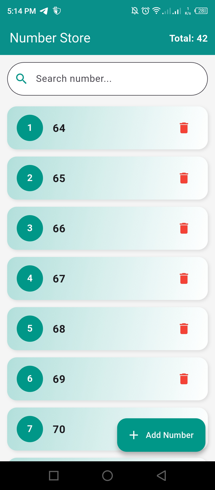
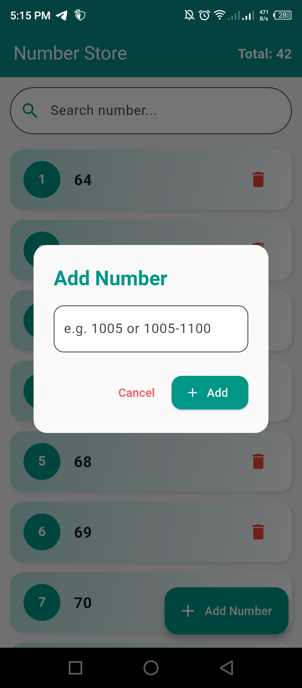
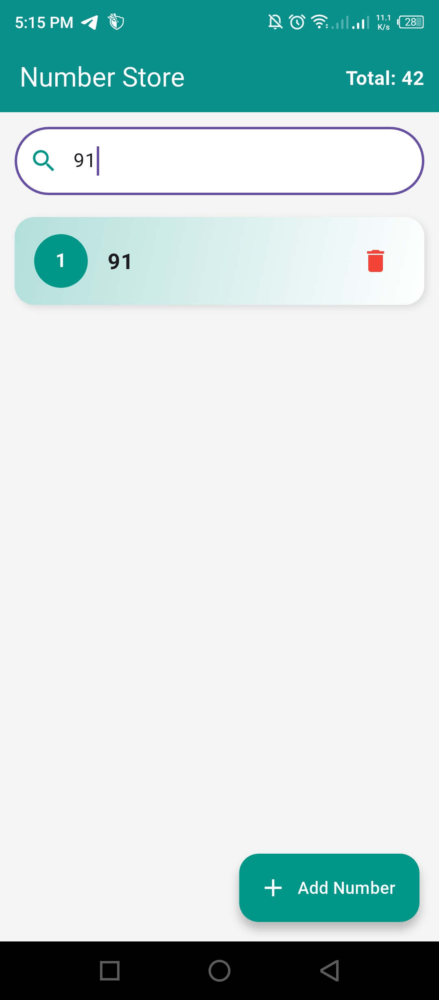

# 📱 Number Store App

A simple and beautiful **Flutter app** that allows you to **store numbers**, including number ranges, and search through them easily.  
Built using **Hive** for local storage, so your data is saved even after closing the app.

---

## ✨ Features

- ➕ **Add single numbers** or **entire ranges** (e.g. `1005-1100`) with one click  
- 🔍 **Search** for numbers instantly with a search bar  
- 🗑 **Delete** numbers individually  
- 💾 Data is stored **locally** using Hive (no internet required)  
- 🎨 **Modern UI** with gradient backgrounds and smooth animations  
- 📊 **Live total count** of stored numbers in the AppBar  

---

## 📸 Screenshots
  
  | Home Page | Add Number Dialog | Search |
  |-----------|------------------|--------|
  |  |  |  |

---

## 🛠 Tech Stack

- **Flutter** (UI Framework)  
- **Hive & hive_flutter** (Local Database)  
- **Material Design** (UI Components)  

---
